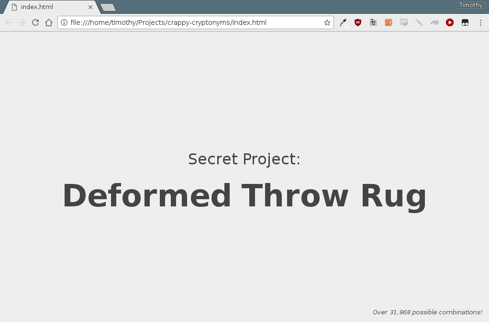

# [crappy-cryptonyms](https://keithieopia.github.io/crappy-cryptonyms/) :poop:

> Great repository names are short and memorable. Need inspiration? You could use GitHub's random respository name generator. Or you could use **crappy-cryptonyms** instead.

Generate dubious sounding [code names](https://en.wikipedia.org/wiki/Code_name) and [CIA cryptonyms](https://en.wikipedia.org/wiki/CIA_cryptonym) for your next super secret project. Perfect for the aspiring evil genius hellbent on world domination!

Featuring over 31,968 possible combinations such as:

- Code Word: *Grumpy Pastrami*
- Operation: *Saber-Toothed Goose*
- Code Name: *Plebeian Swashbuckler*
- Secret Project: *Stereotypical Abyss*
- *... and more!*

## License

Licensed under the [MIT license](https://github.com/keithieopia/crappy-cryptonyms/blob/master/LICENSE).

*This is free software: you are free to change and redistribute it. There is NO WARRANTY, to the extent permitted by law.*

---

<em>
May cause increased scrutiny by superheros. Not responsible for inept minions or accidents involving death rays.
</em>